# Assessment & Examination App 📝

*A comprehensive mobile platform for real-time test-taking, featuring secure authentication, seamless assessment management, and a striking neon user interface.*

## 📱 Application Flow & Previews

  <table>
    <!-- Row 1: Core Authentication & Entry -->
    <tr>
      <td align="center">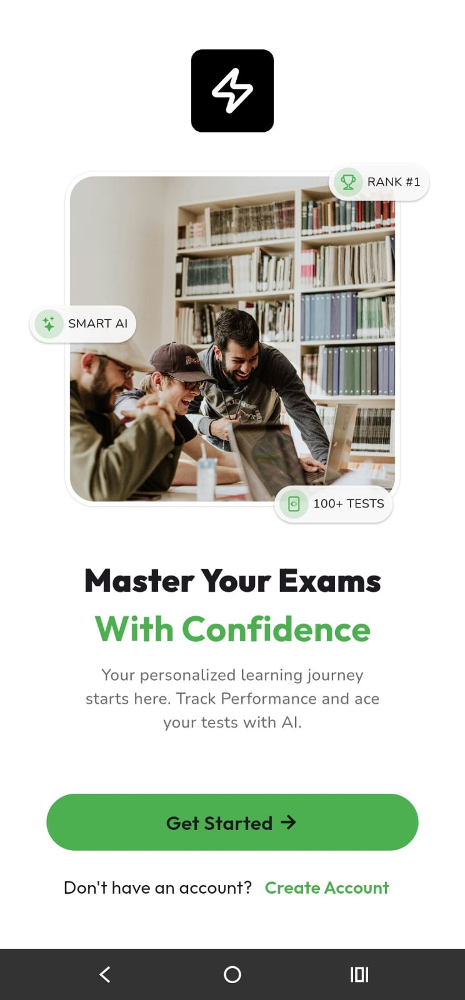 <b>Onboarding</b></td>
      <td align="center">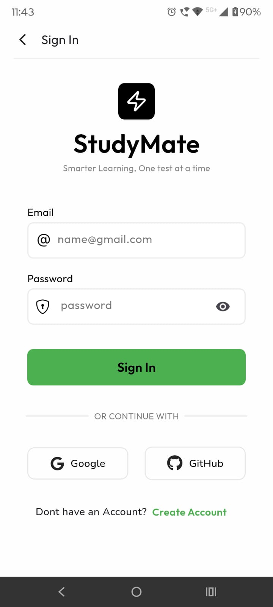 <b>Login</b></td>
      <td align="center">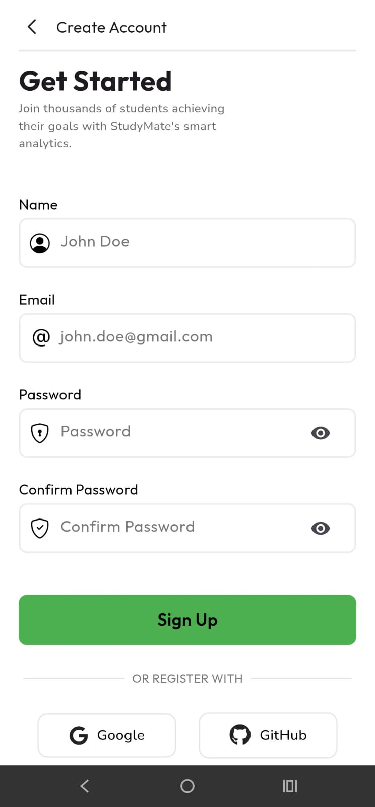 <b>Register</b></td>
      <td align="center">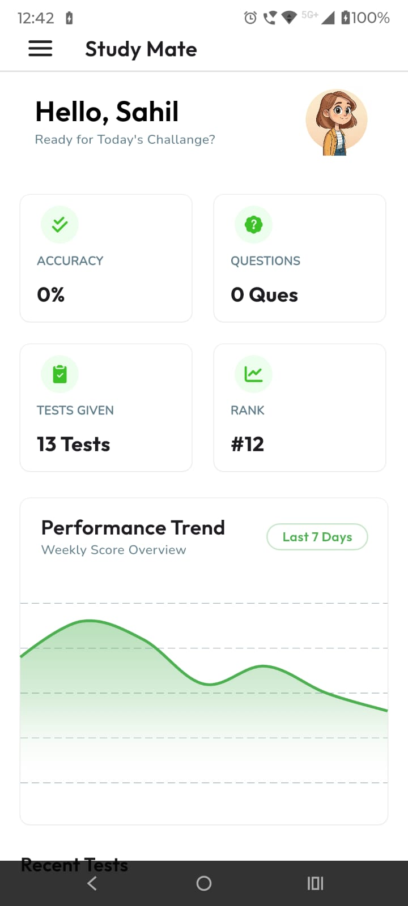 <b>Homepage</b></td>
    </tr>
    <!-- Row 2: Examination Engine Flow -->
    <tr>
      <td align="center">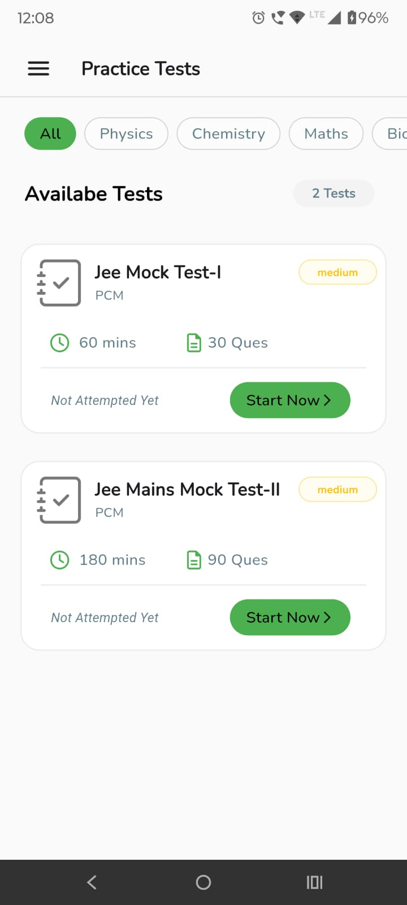 <b>Tests List</b></td>
      <td align="center">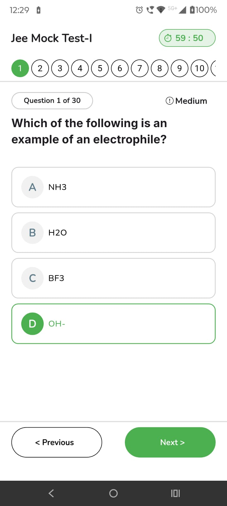 <b>Test Session</b></td>
      <td align="center">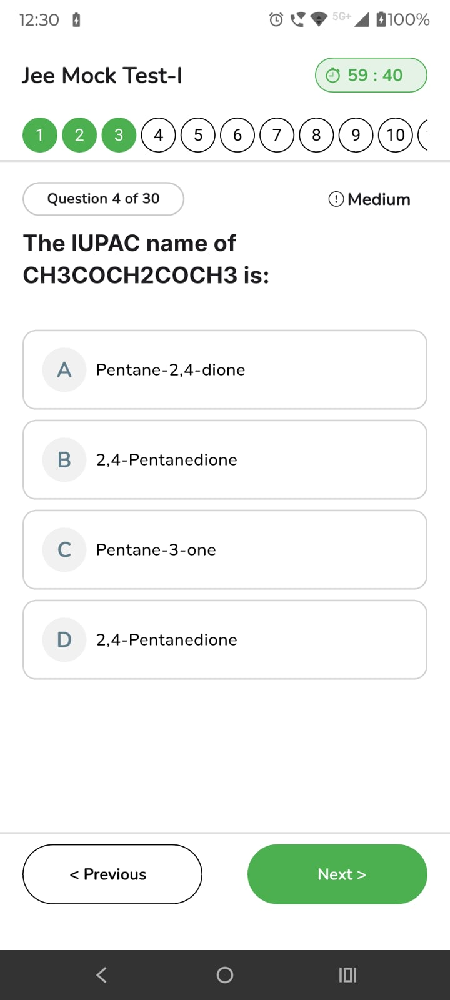 <b>Review & Submit</b></td>
      <td align="center">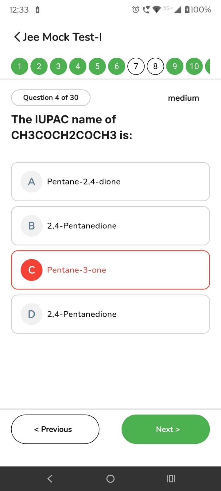 <b>Error Review</b></td>
    </tr>
    <!-- Row 3: Metrics, Analytics & Results -->
    <tr>
      <td align="center">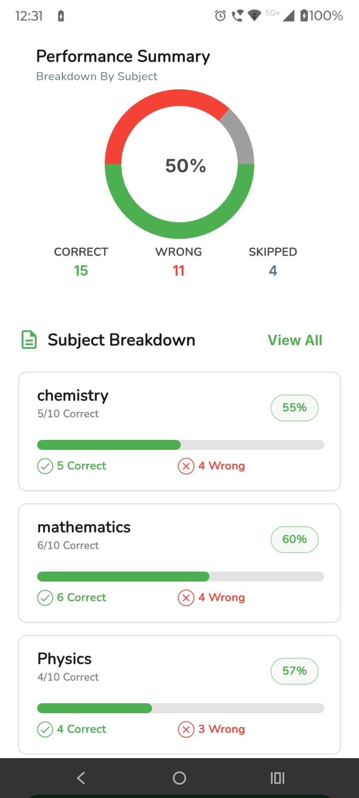 <b>Performance Analytics</b></td>
      <td align="center">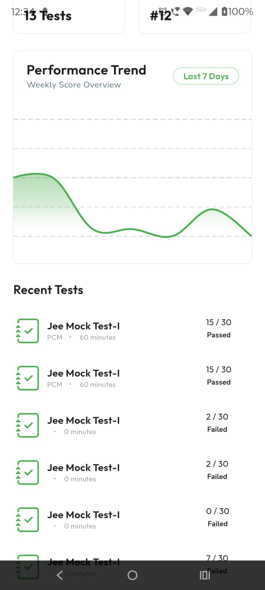 <b>Updated Dashboard</b></td>
      <td align="center">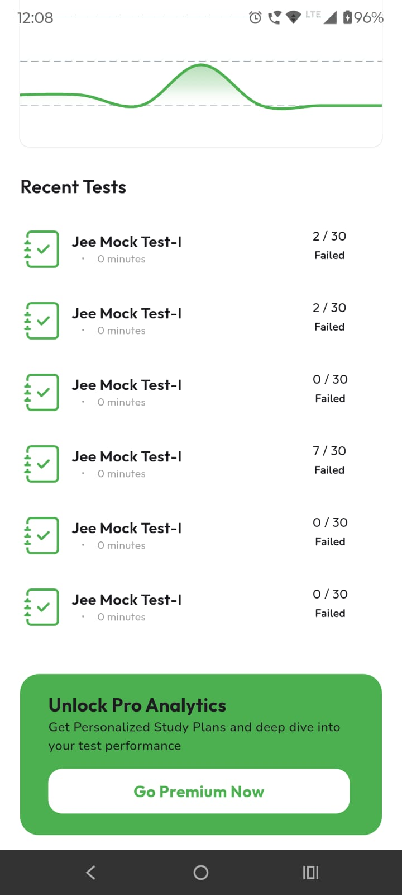 <b>History Logs</b></td>
      <td align="center">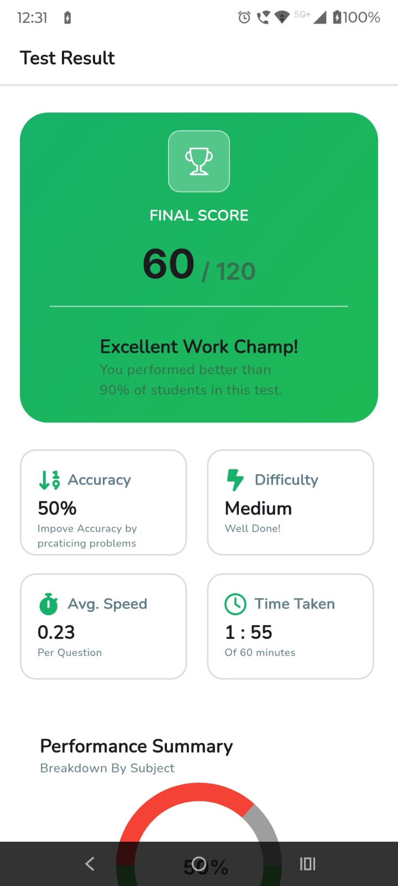 <b>Scorecard</b></td>
    </tr>
  </table>

> **Note:** Update the `src` paths above with your actual GitHub issue links or relative asset paths.

## ✨ Key Features

*   **Striking Neon UI:** A custom-designed, visually engaging neon theme applied consistently across onboarding, dashboards, and testing interfaces.
*   **Predictable State Management:** Utilizes the BLoC (Business Logic Component) pattern to strictly decouple UI components from the underlying business logic, ensuring scalable and testable code.
*   **Secure Authentication:** End-to-end token validation ensuring that only registered users can access the homepage and active assessments.
*   **Dynamic Assessment Engine:** Fetches live test data, including varied question types, directly from the backend API.
*   **Reliable Submission Pipeline:** Packages test data and pushes it to the backend infrastructure, handling loading states and success/failure confirmations on the submission page.

## 🏗️ Architecture & Tech Stack

**Frontend (Mobile Client)**
*   **Framework:** Flutter (Dart)
*   **State Management:** BLoC
*   **UI/UX:** Custom Neon Theme
*   **Local Persistence:** Hive (for caching user session tokens and offline data)

**Backend (API & Infrastructure)**
*   **Server:** ASP.NET Core Web API
*   **Database:** MongoDB
*   **Deployment Architecture:** Containerized microservices using Docker, orchestrated via Kubernetes.

## 🚀 Getting Started

### Prerequisites
*   Flutter SDK (v3.0 or higher)
*   .NET 8.0 SDK (for local backend development)
*   A running instance of MongoDB (Local or Atlas)

